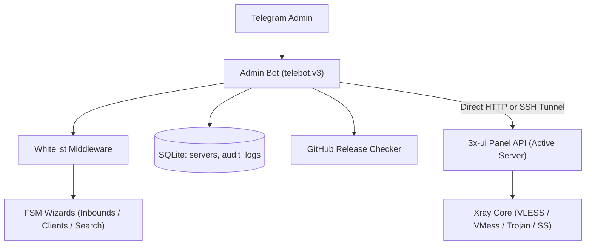

<div align="center">

# 3x-ui Telegram Admin Bot

### Server and Inbound Management for 3x-ui directly from Telegram

Servers, Inbounds (VLESS-Reality), users, configurations and QR codes, system monitoring, and secure deployment in a single Telegram bot written in Go.

[](https://go.dev/)
[](LICENSE)
[](https://t.me/BotFather)
[](https://github.com/MHSanaei/3x-ui)
[](https://modernc.org/sqlite)

[Russian](README.md) · [Installation](docs/installation.en.md) · [Usage](docs/usage.en.md) · [Configuration](docs/configuration.en.md) · [Architecture](docs/architecture.en.md)

</div>

## About the Project

A Telegram bot for the [3x-ui](https://github.com/MHSanaei/3x-ui) panel written in pure Go. The bot operates autonomously, replaces the web panel for daily administrative tasks, requires no CGO dependencies, and consumes under 20 MB of RAM.

| Inbounds & Servers | Users, Protocols & Diagnostics |
|---|---|
| Multi-server support: manage multiple 3x-ui instances (`/servers`) | Step-by-step client provisioning with UUIDv4 generation |
| Secure in-memory SSH tunnel: no need to expose panel port | Real-time online client status indicators (🟢/⚪/⏸) |
| Step-by-step FSM wizard for creating VLESS-Reality inbounds | Universal protocols: subLinks, VLESS, VMess, Trojan, Shadowsocks |
| Reality masking presets (Apple, Yahoo, iCloud, Google) | Global client search across all inbounds by email/UUID (`/search`) |
| Automated generation of X25519 key pairs and Short IDs | In-app inspection and download of x-ui & Xray system logs (`/logs`) |
| System monitoring and GitHub release update notifications | Comprehensive audit log of all administrative actions in SQLite |

## Quick Start

Running the bot requires Go 1.22+, a functioning 3x-ui panel, and a bot token from @BotFather:

```bash
git clone https://github.com/Zhenka07/3x-ui-telegram-bot.git
cd 3x-ui-telegram-bot
CGO_ENABLED=0 GOOS=linux GOARCH=amd64 go build -trimpath -ldflags="-s -w" -o admin-bot ./cmd/admin
```

Step-by-step instructions for systemd service setup and `.env` configuration are detailed in the [installation guide](docs/installation.en.md).

## System Architecture



The bot utilizes a full-featured 3x-ui API client with automatic session re-authentication upon receiving HTTP 401 and seamless compatibility with both modern JSON APIs and legacy escaped JSON strings.

## Security

- access restricted via Telegram ID allowlist `ADMIN_IDS` at the middleware layer;
- optional secure panel access via in-memory SSH port forwarding without opening public ports;
- secrets and tokens are loaded strictly from local `.env` files protected by mode `0600`;
- QR code generation is performed in memory without writing temporary files to disk;
- SQLite storage operates via the pure-Go `modernc.org/sqlite` driver without CGO;
- context timeouts applied to every handler prevent background goroutines from hanging.

## Documentation

| Guide | Description |
|---|---|
| [Installation](docs/installation.en.md) | Deployment on Linux, systemd setup, and service management |
| [Usage](docs/usage.en.md) | Step-by-step wizards for inbounds and clients, commands, monitoring |
| [Configuration](docs/configuration.en.md) | Comprehensive reference for all `.env` environment variables |
| [Architecture](docs/architecture.en.md) | Component diagrams, database schemas, and 3x-ui API client design |
| [Troubleshooting](docs/troubleshooting.en.md) | Diagnostics and resolution of common errors and operational issues |
| [Development](docs/development.en.md) | Source compilation, test execution, and codebase standards |
| [Repository Map](docs/repository-map.en.md) | Directory structure overview and core file purposes |
| [Contributing](CONTRIBUTING.en.md) | Contribution guidelines, coding conventions, and pull requests |
| [Changelog](CHANGELOG.md) | Release history and newly introduced features |

## License

This project is licensed under the terms of the [MIT License](LICENSE).
