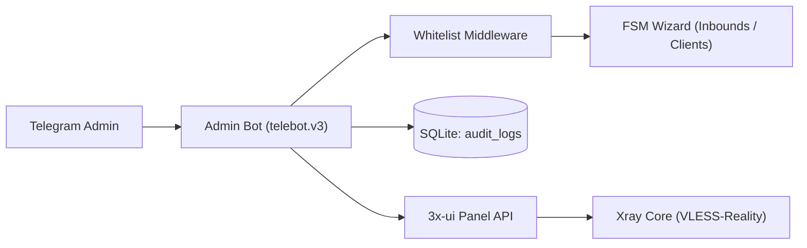

<div align="center">

# 3x-ui Telegram Admin Bot

### Управление сервером и подключениями 3x-ui прямо из Telegram

Серверы, Inbounds (VLESS-Reality), пользователи, конфигурации и QR-коды, системный мониторинг и безопасное развертывание в одном Telegram-боте на Go.

[](https://go.dev/)
[](LICENSE)
[](https://t.me/BotFather)
[](https://github.com/MHSanaei/3x-ui)
[](https://modernc.org/sqlite)

[English](README.en.md) · [Установка](docs/installation.md) · [Использование](docs/usage.md) · [Конфигурация](docs/configuration.md) · [Архитектура](docs/architecture.md)

</div>

## Что это за проект

Telegram-бот для панели [3x-ui](https://github.com/MHSanaei/3x-ui), написанный на чистом Go. Бот работает автономно, заменяет веб-панель для повседневных задач администрирования, не требует CGO-зависимостей и потребляет менее 20 МБ оперативной памяти.

| Подключения (Inbounds) и система | Пользователи и клиенты |
|---|---|
| Пошаговый FSM-мастер создания VLESS-Reality подключений | Пошаговое добавление клиентов с генерацией UUIDv4 |
| Гибкий выбор порта: случайный (15000–55000), 443 или ручной | Настройка лимитов трафика, срока действия и лимита IP |
| Пресеты Reality-маскировки (Apple, Yahoo, iCloud, Google) | Выдача доступа: генерация ссылки `vless://` и QR-кода |
| Автоматическая генерация ключей X25519 и ShortId | Управление клиентом: включение, отключение, сброс, удаление |
| Системный мониторинг: CPU, RAM, Uptime и служба Xray | Журнал аудита всех операций администратора в SQLite |

## Быстрый старт

Для запуска требуются Go 1.22+, работающая панель 3x-ui и токен бота от @BotFather:

```bash
git clone https://github.com/Zhenka07/3x-ui-telegram-bot.git
cd 3x-ui-telegram-bot
CGO_ENABLED=0 GOOS=linux GOARCH=amd64 go build -trimpath -ldflags="-s -w" -o admin-bot ./cmd/admin
```

Пошаговая инструкция по настройке службы systemd и параметров `.env` приведена в [руководстве по установке](docs/installation.md).

## Архитектура системы



Бот использует полнофункциональный API-клиент 3x-ui с автоматической переавторизацией сессий при получении HTTP 401 и поддержкой как современного JSON API, так и экранированных JSON-строк.

## Безопасность

- ограничение доступа по белому списку Telegram ID `ADMIN_IDS` на уровне middleware;
- секреты и токены загружаются исключительно из локального файла `.env` с правами `0600`;
- генерация QR-кодов выполняется в оперативной памяти без записи временных файлов на диск;
- база данных аудита SQLite работает через драйвер `modernc.org/sqlite` без CGO;
- ограничение таймаута контекста для каждого запроса исключает зависание фоновых горутин.

## Документация

| Руководство | Содержание |
|---|---|
| [Установка](docs/installation.md) | Развёртывание на Linux, настройка systemd и запуск службы |
| [Использование](docs/usage.md) | Пошаговые мастера inbounds и клиентов, команды и мониторинг |
| [Конфигурация](docs/configuration.md) | Справочник всех параметров окружения `.env` |
| [Архитектура](docs/architecture.md) | Схема компонентов, структура базы данных и API-клиент 3x-ui |
| [Решение проблем](docs/troubleshooting.md) | Диагностика и устранение типовых ошибок и сбоев |
| [Разработка](docs/development.md) | Сборка из исходников, запуск тестов и стандарты кода |
| [Карта репозитория](docs/repository-map.md) | Описание назначения файлов и структуры каталогов |
| [Участие в разработке](CONTRIBUTING.md) | Правила оформления pull requests и требований к коду |
| [История изменений](CHANGELOG.md) | Перечень версий и добавленного функционала |

## Лицензия

Проект распространяется на условиях [лицензии MIT](LICENSE).
