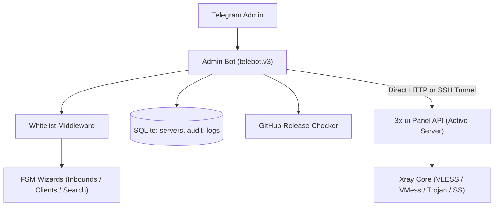

# System Architecture

[Russian version](architecture.md)

## Components

- `admin-bot` — administrator bot with FSM wizards for inbounds/clients, monitoring, and audit;
- `SSH Tunnel` (`internal/sshtunnel`) — in-memory TCP tunneling for secure connection to private panels;
- `3x-ui` — Xray management panel with REST API (supporting one or multiple server instances);
- `Xray core` — VPN core serving VLESS, VMess, Trojan, and Shadowsocks protocols;
- `Updater` (`internal/updater`) — GitHub API release checker and version comparison cache;
- `SQLite` — lightweight local embedded database without CGO (`audit_logs` and `servers`).



## Database Schema

The bot uses an embedded SQLite database located in the `data/` directory:

```sql
-- Audit logs for administrator operations
CREATE TABLE IF NOT EXISTS audit_logs (
    id INTEGER PRIMARY KEY AUTOINCREMENT,
    timestamp DATETIME NOT NULL,
    admin_tg_id INTEGER NOT NULL,
    action TEXT NOT NULL,
    target_id INTEGER,
    client_email TEXT,
    details TEXT
);

-- Registry of managed servers
CREATE TABLE IF NOT EXISTS servers (
    id TEXT PRIMARY KEY,
    name TEXT NOT NULL,
    base_url TEXT NOT NULL,
    username TEXT NOT NULL,
    password TEXT NOT NULL,
    server_host TEXT NOT NULL,
    is_active INTEGER NOT NULL DEFAULT 0,
    created_at DATETIME NOT NULL
);
```

## 3x-ui API Client

- authentication via `/login` with session cookie persistence in `net/http/cookiejar`;
- automatic re-authentication (`ensureSession`) upon receiving `401 Unauthorized` responses;
- dual-format data handling: modern JSON object and legacy escaped JSON string payloads;
- safe body draining and closing to ensure HTTP keep-alive connection reuse.

## Security and Resilience

- middleware-level access restriction based on Telegram ID allowlist `ADMIN_IDS`;
- in-memory QR code generation avoiding temporary files on disk;
- static binary builds without CGO dependencies via `modernc.org/sqlite`;
- context request timeouts (`handlerTimeout = 30s`) preventing hung goroutines.
