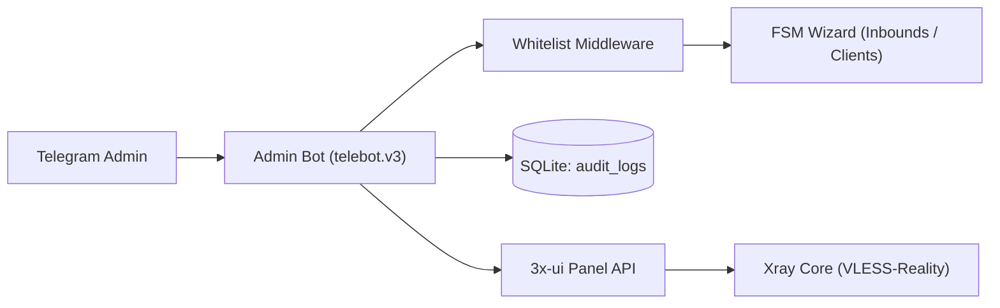

# System Architecture

[Russian version](architecture.md)

## Components

- `admin-bot` — administrator bot with FSM wizards for inbounds/clients and SQLite audit logging;
- `3x-ui` — Xray management panel providing REST API and web UI;
- `Xray core` — VPN core serving the VLESS-Reality protocol;
- `SQLite` — lightweight local embedded database without CGO (`audit_logs`).



## Database Schema

The bot uses an embedded SQLite database located in the `data/` directory:

```sql
CREATE TABLE IF NOT EXISTS audit_logs (
    id INTEGER PRIMARY KEY AUTOINCREMENT,
    timestamp DATETIME NOT NULL,
    admin_tg_id INTEGER NOT NULL,
    action TEXT NOT NULL,
    target_id INTEGER,
    client_email TEXT,
    details TEXT
);
```

## 3x-ui API Client

- authentication via `/login` with session cookie persistence in `net/http/cookiejar`;
- automatic re-authentication (`ensureSession`) upon receiving `401 Unauthorized` responses;
- dual-format data handling: modern JSON object and legacy escaped JSON string payloads;
- safe body draining and closing to ensure HTTP keep-alive connection reuse.

## Security and Resilience

- middleware-level access restriction based on Telegram ID allowlist `ADMIN_IDS`;
- in-memory QR code generation avoiding temporary files on disk;
- static binary builds without CGO dependencies via `modernc.org/sqlite`;
- context request timeouts (`handlerTimeout = 30s`) preventing hung goroutines.
