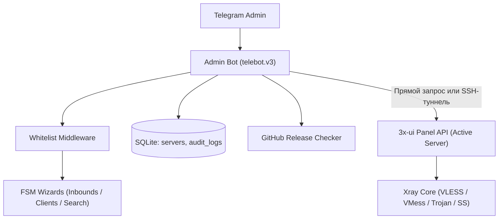

# Архитектура системы

[English version](architecture.en.md)

## Компоненты

- `admin-bot` — бот администратора с FSM-мастерами inbounds/clients, мониторингом и аудитом;
- `SSH Tunnel` (`internal/sshtunnel`) — in-memory TCP туннелирование для безопасного соединения с приватными панелями;
- `3x-ui` — панели управления Xray с REST API (поддержка одного или нескольких серверов);
- `Xray core` — VPN-ядро, обслуживающее протоколы VLESS, VMess, Trojan, Shadowsocks;
- `Updater` (`internal/updater`) — сервис кэширования и сравнения версий релизов 3x-ui с GitHub API;
- `SQLite` — легковесная локальная база данных без CGO (`audit_logs` и `servers`).



## Схема базы данных

Бот использует встроенную базу данных SQLite в каталоге `data/`:

```sql
-- Журнал действий администраторов
CREATE TABLE IF NOT EXISTS audit_logs (
    id INTEGER PRIMARY KEY AUTOINCREMENT,
    timestamp DATETIME NOT NULL,
    admin_tg_id INTEGER NOT NULL,
    action TEXT NOT NULL,
    target_id INTEGER,
    client_email TEXT,
    details TEXT
);

-- Реестр управляемых серверов
CREATE TABLE IF NOT EXISTS servers (
    id TEXT PRIMARY KEY,
    name TEXT NOT NULL,
    base_url TEXT NOT NULL,
    username TEXT NOT NULL,
    password TEXT NOT NULL,
    server_host TEXT NOT NULL,
    is_active INTEGER NOT NULL DEFAULT 0,
    created_at DATETIME NOT NULL
);
```

## API-клиент 3x-ui

- аутентификация через `/login` с сохранением сессионных cookie в `net/http/cookiejar`;
- автоматический повторный логин (`ensureSession`) при получении ответа `401 Unauthorized`;
- поддержка двух форматов данных: современного JSON-объекта и экранированной JSON-строки;
- безопасное чтение и закрытие тел ответов для переиспользования HTTP keep-alive соединений.

## Безопасность и отказоустойчивость

- ограничение доступа на уровне middleware по белому списку Telegram ID `ADMIN_IDS`;
- генерация QR-кодов в памяти без сохранения временных файлов на диск;
- статические бинарные сборки без зависимостей CGO через `modernc.org/sqlite`;
- таймауты обработки контекста (`handlerTimeout = 30s`) для предотвращения зависания горутин.
