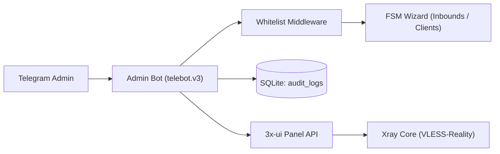

# Архитектура системы

[English version](architecture.en.md)

## Компоненты

- `admin-bot` — бот администратора с FSM-мастерами inbounds/clients и SQLite аудитом;
- `3x-ui` — панель управления Xray с REST API и веб-интерфейсом;
- `Xray core` — VPN-ядро, обслуживающее протокол VLESS-Reality;
- `SQLite` — легковесная локальная база данных без CGO (`audit_logs`).



## Схема базы данных

Бот использует встроенную базу данных SQLite в каталоге `data/`:

```sql
CREATE TABLE IF NOT EXISTS audit_logs (
    id INTEGER PRIMARY KEY AUTOINCREMENT,
    timestamp DATETIME NOT NULL,
    admin_tg_id INTEGER NOT NULL,
    action TEXT NOT NULL,
    target_id INTEGER,
    client_email TEXT,
    details TEXT
);
```

## API-клиент 3x-ui

- аутентификация через `/login` с сохранением сессионных cookie в `net/http/cookiejar`;
- автоматический повторный логин (`ensureSession`) при получении ответа `401 Unauthorized`;
- поддержка двух форматов данных: современного JSON-объекта и экранированной JSON-строки;
- безопасное чтение и закрытие тел ответов для переиспользования HTTP keep-alive соединений.

## Безопасность и отказоустойчивость

- ограничение доступа на уровне middleware по белому списку Telegram ID `ADMIN_IDS`;
- генерация QR-кодов в памяти без сохранения временных файлов на диск;
- статические бинарные сборки без зависимостей CGO через `modernc.org/sqlite`;
- таймауты обработки контекста (`handlerTimeout = 30s`) для предотвращения зависания горутин.
